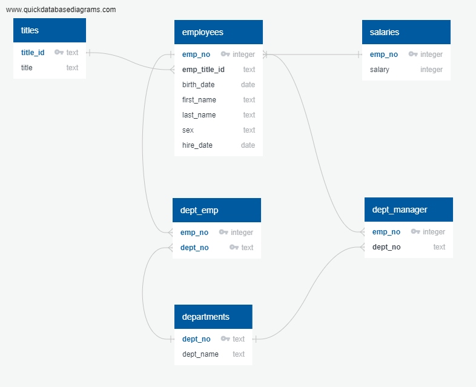
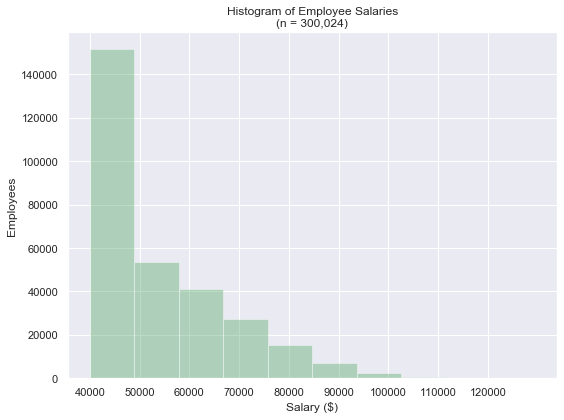
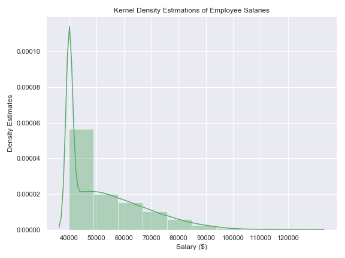

# Investigating Employee Data

## Overview
Created a database in PostgreSQL that included six tables of employee information (names, salaries, titles, etc.). Performed SQL queries in PostgreSQL, and then created histogram of employee salaries as well as a bar chart of employee salaries by title with Jupyter Notebook using SQLAlchemy and Pandas.

### Created a Database
Created an employee database in PostgreSQL containing six tables. Created tables using code contained in the file, create_tables.sql. Imposed constraints such as specifying columns not to accept null values. Information for each table was imported from a CSV file (CSV data not included). The following ERD diagram shows table relationships, data types, primary keys, and foreign keys.

### Performed SQL Queries in PostgreSQL

1. Listed the following details of each employee: employee number, last name, first name, sex, and salary.

2. Listed first name, last name, and hire date for employees who were hired in 1986.

3. Listed the manager of each department with the following information: department number, department name, the manager's employee number, last name, first name.

4. Listed the department of each employee with the following information: employee number, last name, first name, and department name.

5. Listed first name, last name, and sex for employees whose first name is "Hercules" and last names begin with "B."

6. Listed all employees in the Sales department, including their employee number, last name, first name, and department name.

7. Listed all employees in the Sales and Development departments, including their employee number, last name, first name, and department name.

8. In descending order, listed the frequency count of employee last names, i.e., how many employees shared each last name.

### Performed Analysis with Pandas via SQLAlchemy

1. Created a histogram (and KDE) to visualize the most common salary ranges for employees.

2. Created a bar chart of average salary by title.

